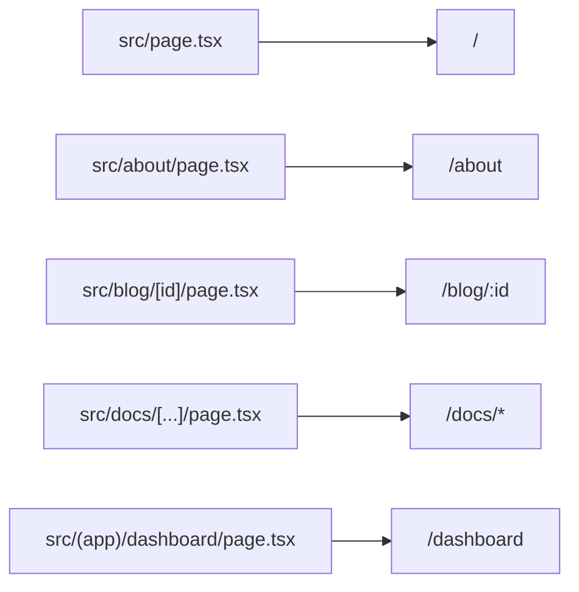

# ajo-kit

Full-stack metaframework for [Ajo](https://github.com/cristianfalcone/ajo) with file-based routing, server handlers, form actions, middleware, migrations, and SSE route payload updates.

## Install

```bash
pnpm add ajo ajo-kit
pnpm add -D vite typescript @types/node
```

`ajo-kit` requires `ajo ^0.1.35`, `vite ^8.0.16`, and Node 22.18 or newer.
TypeScript migrations run through Node's built-in type stripping and use
erasable TypeScript syntax.

## Minimal Setup

### `package.json`

```json
{
  "type": "module",
  "scripts": {
    "dev": "kit dev",
    "build": "kit build",
    "start": "kit start"
  }
}
```

### `vite.config.ts`

```ts
import { defineConfig } from 'vite'
import { kit, jsx } from 'ajo-kit/vite'

export default defineConfig({
  plugins: [...kit()],
  esbuild: jsx,
})
```

### `tsconfig.json`

```json
{
  "compilerOptions": {
    "target": "ESNext",
    "module": "ESNext",
    "moduleResolution": "bundler",
    "allowImportingTsExtensions": true,
    "isolatedModules": true,
    "noEmit": true,
    "jsx": "react-jsx",
    "jsxImportSource": "ajo",
    "strict": true,
    "paths": {
      "/src/*": ["src/*"],
      "@kit": ["node_modules/ajo-kit/src/index.ts"],
      "@kit/*": ["node_modules/ajo-kit/src/*"]
    }
  }
}
```

### `index.html`

```html
<!DOCTYPE html>
<html lang="en">
<head>
  <meta charset="UTF-8">
  <meta name="viewport" content="width=device-width, initial-scale=1.0">
  <!-- ssr:head -->
</head>
<body>
  <!-- ssr:data -->
  <div id="root"><!-- ssr:root --></div>
  <script src="/src/client" type="module"></script>
</body>
</html>
```

### `src/page.tsx`

```tsx
export default () => (
  <main>
    <h1>Welcome to ajo-kit</h1>
    <p>Edit <code>src/page.tsx</code> to get started.</p>
  </main>
)
```

## CLI

```bash
kit dev [-p 5173]
kit build
kit start [-p 5173]

kit migrate up [-d ./database.sqlite]
kit migrate down [-d ./database.sqlite]
kit migrate status [-d ./database.sqlite]
kit migrate create <name>

kit seed [-d ./database.sqlite]
```

Defaults:

- database: `./database.sqlite`
- migrations folder: `db/migrations`
- seeds folder: `db/seeds`

## Routing

File-based routes:



Per-route files:

- `page.tsx`: page component
- `layout.tsx`: shared wrapper for a route branch
- `handler.ts`: server loaders/actions/api handlers
- `wares.ts`: middleware for that branch and descendants

`page.tsx` and `layout.tsx` modules can export `pending = true` to receive
`loading=true` while client navigation waits for route data. The page wins
first; otherwise the innermost pending layout handles it.

## Server Handlers

`handler.ts` supports:

```ts
import type { Request, Response } from '@kit'
import { send } from '@kit/server'
import type { Head } from '@kit'

export async function layout(req: Request, parent: () => Promise<Record<string, unknown>>) {
  return {}
}

export async function page(req: Request, parent: () => Promise<Record<string, unknown>>) {
  return {}
}

export async function head(req: Request, parent: () => Promise<Record<string, unknown>>): Promise<Head> {
  return { title: 'My page' }
}

export const actions = {
  async save(req: Request, res: Response) {
    return { ok: true }
  }
}

export default {
  async get(req: Request, res: Response) {
    send(res, 200, { ok: true })
  }
}
```

Notes:

- `default` maps HTTP methods to `/api/<route>`.
- API handlers in `default` must write/send the HTTP response.
- `actions` are invoked by `POST /current-route?/actionName`.
- action `"default"` is used when no `?/name` is provided.
- `parent()` resolves merged ancestor loader data.

## Actions from Client

```tsx
import { action } from '@kit/client'

const Page = function* () {
  const form = action<{ ok: boolean }>('save')

  while (true) {
    yield (
      <form onsubmit={form.submit}>
        <input name="title" />
        <button disabled={form.loading}>Save</button>
        {form.error && <p>{form.error.message}</p>}
      </form>
    )
  }
}
```

You can also trigger programmatically:

```ts
await form.invoke({ title: 'Hello' })
```

If an action returns `{ redirect: '/path' }`, client navigation is triggered automatically.
Successful non-redirect actions dispatch `ajo:action` with returned JSON detail.

## Middleware

`wares.ts` exports one middleware or an array:

```ts
import type { Middleware } from '@kit'

const log: Middleware = (req, _res, next) => {
  console.log(req.method, req.url)
  next()
}

export default log
```

Middlewares are collected from route ancestors and applied to both page and API handlers.

## SSE Topics (Live Updates)

Track topics in loaders, then emit from server code after mutations:

```ts
// src/chat/handler.ts
import { emit } from '@kit/server'

export async function page(req) {
  req.track?.('messages')
  return { messages: [] }
}

export const actions = {
  async create(req) {
    // write to DB...
    emit('messages')
    return { ok: true }
  }
}
```

The runtime maintains an SSE stream, revalidates affected routes, and replaces the active route payload when tracked topics change.

## Route cache and its scope

The client keeps a small in-memory cache of route payloads (50 entries, 5
minute TTL) and revalidates with `X-Have`, so an unchanged route costs a 304
instead of a payload. Login and logout are SPA navigations — no reload clears
that cache — so every entry is partitioned by a **scope**: an opaque label the
server derives per request from whichever credential your auth middleware
attached (`req.token`, `req.session`, `req.user`, else `anon`), hashed with its
keyspace so ids from different tables cannot collide. Set `req.scope` in a
middleware to decide the partition yourself.

The scope travels in the SSR document, in route JSON, and in live messages.
The client caches only under the scope the payload was computed for, drops the
previous partition when the identity changes, and presents the scope alongside
its freshness material — the server's fast 304 confirms a hash only for the
identity that cached it. Without a scope nothing is cached at all: guessing
wrong would mean showing one person another person's data, so it fails closed.

## Database and Migrations

`ajo-kit/database` exports:

- `connect(path?)`
- `db<T>()`
- `raw()`
- `close()`
- `Database` (better-sqlite3)
- `sql` and Kysely types

SSE topic versions, active connections, and update fanout are stored in process
memory. Multi-process deployments require shared topic coordination and
fanout. Store SQLite database files on persistent local disk.

For non-local production, configure `APP_URL` to the public `http` or `https`
origin. Applications choose how to configure their database path:

```ts
connect(process.env.DATABASE_PATH ?? './database.sqlite')
```

`kit migrate` composes:

- app migrations in `db/migrations`
- plugin migrations discovered from installed `ajo-*` packages that expose `package.json#kit.migrations`

Each migration provider uses a contiguous sequence beginning at `0001`, so a
plugin and the app may both define `0001_initial`. Stored identities use
`plugin/<package>/<name>` and `project/<name>` in one SQLite history and lock.

Every migration exports `up()` and `down()`. `migrate down` rolls back the
latest executed migration across all providers. `migrate status` rejects
history entries whose migration is unavailable.

`kit seed` runs sorted `db/seeds/*.ts` files that export:

```ts
export async function seed(db) {
  // ...
}
```

## Validation

`@kit/validate` re-exports common Valibot helpers and provides `parse(schema, data)`, which throws `Invalid` with field-level details.

## Plugin Discovery

Installed packages named `ajo-*` (except `ajo-kit`) with a `kit` block in `package.json` are auto-discovered:

```json
{
  "kit": {
    "alias": "auth",
    "serverOnly": true,
    "migrations": "./migrations/",
    "commands": "./src/commands.ts"
  }
}
```

This enables:

- `@kit/<alias>` import aliases
- server-only import protection in Vite
- automatic migration loading
- CLI command extension via `register(cli)`

## Public Entry Points

| Import | API |
|---|---|
| `ajo-kit` or `@kit` | Route types, HTTP errors, request helpers, navigation, and formatting |
| `ajo-kit/server` or `@kit/server` | Server runtime, `send()`, and `emit()` |
| `ajo-kit/client` or `@kit/client` | Client boot and `action()` |
| `ajo-kit/validate` or `@kit/validate` | Valibot helpers and `parse()` |
| `ajo-kit/database` or `@kit/database` | SQLite, Kysely, and database lifecycle |
| `ajo-kit/mail` or `@kit/mail` | Configurable mail transport |
| `ajo-kit/vite` | Vite plugin, JSX config, and defaults |
| `ajo-kit/node` | Programmatic development, build, start, and listen runtime |

## Core API

```ts
import {
  Denied,
  Failure,
  Forbidden,
  Invalid,
  Missing,
  ajax,
  api,
  date,
  ip,
  navigate,
  normalize,
  origin,
} from 'ajo-kit'
import type {
  Action,
  Entry,
  Fields,
  Head,
  Issue,
  LayoutArgs,
  Middleware,
  PageArgs,
  Parent,
  Request,
  Response,
  User,
} from 'ajo-kit'
```

`Failure` carries an HTTP status. `Missing`, `Forbidden`, `Denied`, and
`Invalid` represent 404, 403, 401, and 400 responses. `normalize()` converts an
unknown thrown value into a `Failure`.

`ajax()` and `api()` classify requests. `ip()` resolves the client address, and
`origin()` resolves the trusted application origin. `navigate()` performs
client navigation, and `date()` formats ISO timestamps.

## Server API

```ts
import { emit, send } from 'ajo-kit/server'

send(res, 200, { ok: true })
emit('posts:list')
```

`send()` writes an API response. `emit()` accepts one topic or an array of
topics and revalidates active routes that track them. Emit after durable writes
commit.

## Head

Route `head()` loaders return `Head`. Ancestor and page values are merged for
SSR and client navigation.

```ts
type Head = {
  title?: string
  meta?: (
    | { name: string; content: string }
    | { property: string; content: string }
    | { httpEquiv: string; content: string }
  )[]
  link?: { rel: string; href: string; [key: string]: string | undefined }[]
}
```

## Mail

```ts
import { configure, send } from 'ajo-kit/mail'
import type { Mail, Transport } from 'ajo-kit/mail'

const deliver: Transport = async mail => {
  // Send mail with the application's provider.
}

configure(deliver)

await send({
  to: 'person@example.com',
  subject: 'Welcome',
  text: 'Welcome to the app.',
})
```

`configure()` registers a `Transport` function. Without one, `send()` throws an
actionable error in production. In other environments the default transport
logs only the recipient and subject, never the message body.

## Vite API

```ts
import { jsx, kit } from 'ajo-kit/vite'
import type { Options } from 'ajo-kit/vite'
import { defineConfig } from 'vite'

const options: Options = {
  guard: [/\/src\/data\//],
  css: ['virtual:uno.css'],
}

export default defineConfig({
  plugins: [...kit(options)],
  esbuild: jsx,
})
```

`kit()` configures routes, handlers, aliases, server-only guards, HMR, CSS
entries, and production SSR. Custom `guard` patterns extend the default client
graph protection.

`css` entries load before application hydration. `jsx` configures Ajo's
automatic JSX runtime. The exported `defaults` object contains the database,
migrations, and seeds paths used by the CLI.

## Node API

```ts
import { build, compile, dev, listen, start } from 'ajo-kit/node'
import type { Options } from 'ajo-kit/node'

const options: Options = {
  hmr: { overlay: false },
}

await dev(options)
```

`dev()`, `build()`, and `start()` expose the CLI runtimes programmatically.
`compile()` fills `<!-- ssr:name -->` HTML slots. `listen()` starts an
application server and can require a strict port.
